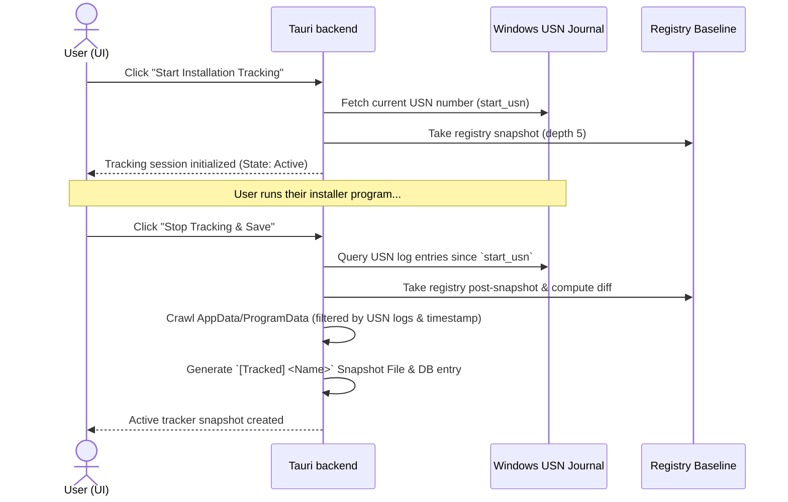

# 📡 Active Installation Tracker (NTFS USN Journal)

The **Active Installation Tracker** monitors file modifications and registry additions in real-time as an installer runs. It utilizes the native Windows NTFS Update Sequence Number (USN) Journal to capture exact file operations with low overhead.

---

## 🛠️ How Active Tracking Works

Unlike standard snapshots which require scanning millions of files twice, the Active Tracker uses the NTFS USN Journal to pinpoint exactly which files were modified during the installation session.

---

## 🔬 Core Technologies

### 1. 🗃️ Windows NTFS USN Journal
The USN Journal is a persistent log maintained by the Windows NTFS file system driver. It records every creation, modification, rename, and deletion of folders and files on the volume.
*   **Handle Creation**: Spawns `CreateFileW` targeting the raw volume namespace `\\.\C:` with `FILE_FLAG_BACKUP_SEMANTICS`.
*   **Querying Journal**: Calls Win32 `DeviceIoControl` with `FSCTL_QUERY_USN_JOURNAL` to fetch the next expected USN index.
*   **Reading Changes**: Calls Win32 `DeviceIoControl` with `FSCTL_READ_USN_JOURNAL` to stream files modified after the recorded start index.
*   **Heuristics Exclusion**: Filters out internal system metadata files starting with `$` (such as `$Mft`, `$LogFile`, `$UsnJrnl`).

---

### 2. 📁 Filesystem Delta Scans
To narrow down additions to developer/application directories (preventing general system background noise from polluting the report), when tracking stops, PurgeKit searches:
*   `%AppData%`
*   `%LocalAppData%`
*   `%ProgramData%`

It only includes files/folders that match either of these conditions:
1.  **Modified Timestamp**: The file's modified time (`metadata.modified()`) is greater than or equal to the session start time.
2.  **USN Journal Match**: The lowercase file name is explicitly present in the list of changed file names retrieved from the USN Journal.

---

### 3. 🔑 Registry Delta Scans
At the start of the session, PurgeKit crawls HKCU and HKLM SOFTWARE keys up to depth 5. When tracking stops, it crawls them again, finds keys that are present in the final crawl but absent in the baseline, and adds them to the tracked snapshot data.

---

## 🔒 Security & Privilege Requirements

Since accessing the volume handle (`\\.\C:`) and reading the USN Journal touches the low-level NTFS driver, **this feature strictly requires Administrator privileges**.
*   If run without admin elevation, `CreateFileW` will return an **Access Denied (Error code 5)**.
*   PurgeKit will display a shield badge and alert dialog in the UI explaining that tracking requires launching as Administrator.
