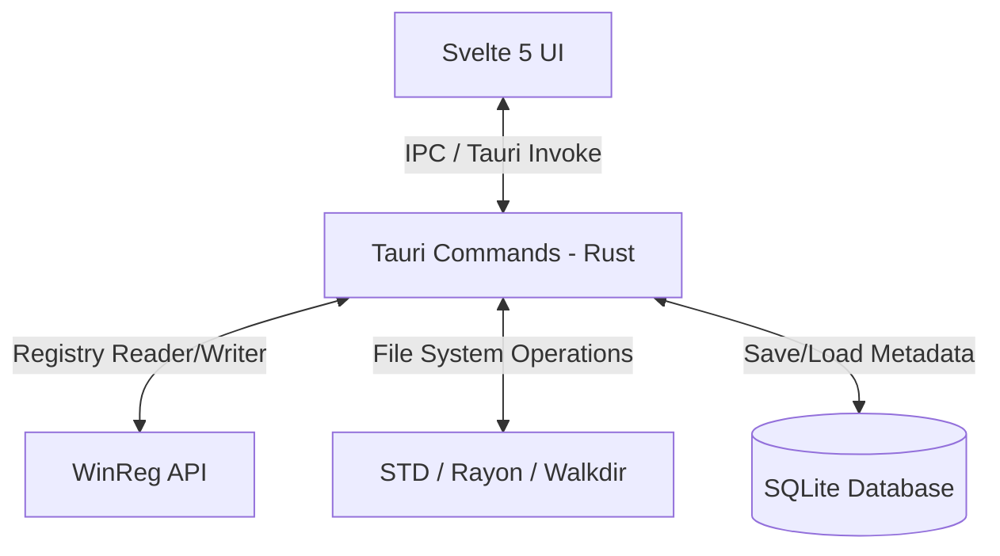

# 📐 PurgeKit Technical Architecture (v1.0.0)

This document describes the design architecture, project structure, database schema, and communication protocols of **PurgeKit v1.0.0**.

---

## 🏗️ Architectural Overview

PurgeKit is built as a **Tauri v2** application. It decouples high-privilege, low-level OS operations (Registry access, file deletion, process creation) into a **Rust backend** while displaying a modern, responsive user interface in a **Svelte 5 frontend**.



---

## 📂 Project Structure & Module Breakdown

### 🦀 Rust Backend (`src-tauri/`)

* **`src/main.rs`**: Application entry point. Parses command-line interfaces (CLI mode) using `clap` and bootstraps the Tauri application.
* **`src/lib.rs`**: Initializes Tauri plugins, configures SQLite database tables, registers Tauri commands, and binds background process lifecycles.
* **`src/db.rs`**: Handles connections to `purgekit.db` (SQLite). Stores and queries snapshot records.
* **`src/snapshot_engine.rs`**: Implements system baseline scanning, JSON compression, and the diff engine.
* **`src/commands.rs`**: Binds Tauri IPC invocations to Rust functions. Handles thread-spawning and background task processing.
* **`src/scanner/`** (Low-level scanner modules):
  - **`registry.rs`**: Queries the uninstallation registry keys for standard 32-bit and 64-bit desktop applications.
  - **`msi.rs`**: Integrates with Windows Installer APIs via Win32 FFI to retrieve MSI application metadata.
  - **`uwp.rs`**: Executes powershell tasks in the background to scan installed Windows Store packages.
  - **`cli_dev.rs`**: Detects and cleans developer tool caches (Cargo, npm, pip, go, yarn, pnpm, etc.).
  - **`remnants.rs`**: Scans the filesystem and registry for orphaned app files using name token matching.
  - **`path_cleaner.rs`**: Sanitizes Windows PATH variables and propagates changes using `WM_SETTINGCHANGE`.
  - **`project_sweeper.rs`**: Traverses project workspace directories in search of heavy build files.
  - **`wsl_shrinker.rs`**: Manages WSL2 distributions, VHDX paths, and automates DiskPart compaction.
  - **`toolchain_sweeper.rs`**: Manages compiler and runtime versions for Rustup, NVM, and FNM.

### ⚡ Frontend Svelte UI (`src/`)

* **`src/routes/+page.svelte`**: Main application container. Manages the active tab state and renders tab views.
* **`src/lib/components/`** (UI Views):
  - **`Sidebar.svelte`**: Hover-expanding sidebar menu containing all modules.
  - **`AppsTab.svelte`**: Renders standard and store apps in a responsive table. Manages uninstallation and displays the remnant cleaning overlay.
  - **`DevToolsTab.svelte`**: Contains tabs for Developer Caches, Global Packages, and Runtimes.
  - **`ProjectSweeperTab.svelte`**: Displays configured scan paths, preset filters, and traverse results.
  - **`WslShrinkerTab.svelte`**: Lists WSL distributions, disk sizes, sparse state, and renders the live DiskPart terminal logs view.
  - **`SnapshotsTab.svelte`**: Step-by-step workflow for taking system snapshots and viewing diff lists.
  - **`PathCleanerTab.svelte`**: Renders PATH entries, broken paths, duplicates, and repair controls.
  - **`SettingsTab.svelte`**: Configures application policies and checks for Administrator execution level.

---

## 🗄️ Database Schema (SQLite)

PurgeKit maintains a local SQLite database file `purgekit.db` inside the `%AppData%\PurgeKit\` folder to store snapshot metadata.

### `snapshots` Table
```sql
CREATE TABLE IF NOT EXISTS snapshots (
    id TEXT PRIMARY KEY,
    name TEXT NOT NULL,
    created_at TEXT NOT NULL,
    data_file_path TEXT NOT NULL,
    reg_count INTEGER NOT NULL,
    file_count INTEGER NOT NULL
);
```

---

## 💬 Tauri IPC Commands Table

The frontend communicates with the Rust backend using Tauri's asynchronous `invoke` method. Below is the list of registered commands:

| Command | Arguments | Return Type | Description |
|---|---|---|---|
| `get_installed_apps` | None | `Vec<InstalledApp>` | Queries uninstallation registries and UWP packages |
| `get_app_remnants` | `appName: String`, `publisher: String`, `installLocation: String` | `Vec<RemnantItem>` | Scans Registry and folders for leftovers |
| `purge_remnants` | `items: Vec<RemnantItem>` | `PurgeResult` | Permanently deletes selected leftover items |
| `get_dev_tools` | None | `Vec<DevToolInfo>` | Returns cache sizes, locations, and versions |
| `clean_dev_tool_cache` | `name: String` | `u64` | Clears cache for a tool; returns bytes freed |
| `list_snapshots` | None | `Vec<SnapshotRecord>` | Retrieves all system snapshot records from SQLite |
| `take_snapshot` | `name: String` | `String` | Recursively indexes OS state and saves JSON |
| `compare_snapshots` | `beforeId: String`, `afterId: String` | `SnapshotDiff` | Compares registry/files to identify additions |
| `delete_snapshot` | `id: String` | None | Wipes snapshot files from disk and database |
| `get_path_entries` | None | `Vec<PathEntry>` | Reads User and System PATH values from registry |
| `save_path_entries` | `remainingValues: Vec<String>`, `scope: String` | None | Writes PATH array to registry and broadcasts update |
| `scan_project_directories` | `roots: Vec<String>`, `folderTypes: Vec<String>` | `Vec<ProjectFolder>` | Traverses workspace roots for build files |
| `delete_project_directories`| `paths: Vec<String>` | `Record<String, String>` | Batch purges selected folders and files |
| `get_wsl_distros` | None | `Vec<WslDistroInfo>` | Returns WSL distributions and virtual disk paths |
| `compact_wsl_distro` | `name: String`, `vhdxPath: String` | `String` | Shuts down WSL and runs DiskPart compaction |
| `set_wsl_distro_sparse_mode`| `name: String`, `sparse: bool` | None | Configures WSL VHDX drive sparse property |
| `get_toolchain_versions` | None | `Vec<ToolchainVersion>` | Scans Rustup, NVM, and FNM version directories |
| `delete_toolchain_version` | `manager: String`, `version: String`, `path: String` | None | Uninstalls runtime versions with folder-purge fallback |
| `check_directory_exists` | `path: String` | `bool` | Checks if a path directory exists on the system |

---

## 📡 Live Log Streaming Protocols (IPC Events)

For long-running tasks, PurgeKit uses Tauri's event-emitter protocol instead of standard request-response loops. This ensures real-time feedback in the Svelte UI:

1. **WSL Disk Compaction**: Spawns a background task running DiskPart. Outflow lines are caught by Rust and emitted via Tauri event `wsl-compact-progress` with payload:
   ```json
   { "phase": "compacting" | "completed" | "error", "message": "DiskPart log string..." }
   ```
2. **Project Sweeper**: As directory traversal runs in a background thread, progress is throttled and emitted via `project-scan-progress` to show the directory currently being searched:
   ```json
   { "current_dir": "D:\\Code\\...", "folders_found": 12, "total_size_bytes": 1024000 }
   ```
3. **Bulk Uninstallation**: Spawns sequential app uninstallations, emitting status logs to the frontend via `bulk-uninstall-progress`:
   ```json
   { "app_id": "...", "app_name": "...", "phase": "uninstalling" | "leftovers", "current": 1, "total": 5, "message": "Uninstalling..." }
   ```
