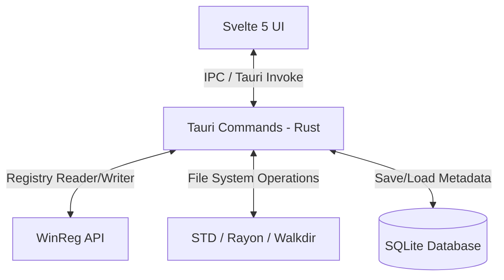

# 📐 PurgeKit Architecture

This document describes the design architecture, project structure, and communication protocols of **PurgeKit**.

---

## 🏗️ Overview

PurgeKit is structured as a **Tauri v2** application, separating the security-sensitive operations (Registry writes, file system deletes) in a **Rust backend** and presenting a reactive user interface in a **Svelte 5 frontend**.



---

## 📂 Project Structure

```
d:\Code\PurgeKit\
├── src-tauri\                 # 🦀 Rust Backend (Tauri)
│   ├── Cargo.toml             # Dependencies (winreg, walkdir, rayon, rusqlite, serde)
│   └── src\
│       ├── main.rs            # Application bootstrap & CLI command parsing
│       ├── lib.rs             # Tauri initialization, SQLite setups, and command bindings
│       ├── db.rs              # SQLite database manager (saves snapshot records)
│       ├── snapshot_engine.rs # Baseline scanner, json compression, and diff engine
│       ├── commands.rs        # Tauri IPC Command interfaces called by Svelte
│       └── scanner\           # Registry, UWP, dev cache, remnants, and PATH logic
│           ├── mod.rs         # Scanner entrypoint
│           ├── registry.rs    # Scan 3 registry hives for installed desktop apps
│           ├── uwp.rs         # Scan Windows Store packages via Powershell
│           ├── cli_dev.rs     # Search dev caches (npm, cargo, pip, go)
│           ├── remnants.rs    # Recursive filesystem/registry orphaned search
│           └── path_cleaner.rs# Windows user & system PATH editor
├── src\                       # ⚡ Frontend (Svelte 5 / TypeScript)
│   ├── app.css                # CSS Variables, global scrollbar, animations
│   ├── app.html               # Google Fonts imports
│   ├── routes\
│   │   ├── +layout.svelte     # Imports global CSS
│   │   └── +page.svelte       # Main layout viewer and tab manager
│   └── lib\components\        # Redesigned UI Views (Ember Orange theme)
│       ├── Sidebar.svelte     # Hover-expanding sidebar (Option B)
│       ├── AppsTab.svelte     # Desktop/Store list + Deep remnants modal
│       ├── DevToolsTab.svelte # Dev tool cache controller + bento statistics
│       ├── SnapshotsTab.svelte # Snapshot baseline workflow stepper & diff viewer
│       ├── PathCleanerTab.svelte # Path variable visualizer & health table
│       └── SettingsTab.svelte # Scanner controls + Admin privilege status
└── static\
    └── logo.png               # Main app logo
```

---

## 🗄️ Database Schema (SQLite)

PurgeKit maintains an SQLite database file `purgekit.db` located inside the local AppData folder (`%AppData%\PurgeKit\`) to store snapshot metadata.

### `snapshots` Table
```sql
CREATE TABLE IF NOT EXISTS snapshots (
    id TEXT PRIMARY KEY,
    name TEXT NOT NULL,
    created_at TEXT NOT NULL,
    data_file_path TEXT NOT NULL,
    reg_count INTEGER NOT NULL,
    file_count INTEGER NOT NULL
);
```

---

## 💬 Tauri IPC Commands

The Svelte frontend communicates with Rust using Tauri's asynchronous `invoke` function:

| Command | Arguments | Return Type | Description |
|---|---|---|---|
| `get_installed_apps` | None | `Vec<InstalledApp>` | Scans Registry (3 hives) and UWP packages |
| `get_app_remnants` | `appName`, `publisher`, `installLocation` | `Vec<RemnantItem>` | Scans for remnants on disk & registry |
| `purge_remnants` | `items` | `PurgeResult` | Deletes selected files & registry paths |
| `get_dev_tools` | None | `Vec<DevToolInfo>` | Returns cache sizes & versions for dev tools |
| `clean_dev_tool_cache` | `name` | `u64` (bytes freed) | Executes cleaner commands for specific tool |
| `list_snapshots` | None | `Vec<SnapshotRecord>` | Retrieves all snapshot records from SQLite |
| `take_snapshot` | `name` | `String` (snapshot ID) | Scans system and saves snapshot |
| `compare_snapshots` | `beforeId`, `afterId` | `SnapshotDiff` | Compares registry and file paths |
| `delete_snapshot` | `id` | None | Deletes snapshot from SQLite and disk |
| `get_path_entries` | None | `Vec<PathEntry>` | Reads User/System PATH environment variables |
| `save_path_entries` | `remainingValues`, `scope` | None | Writes updated PATH list to Windows Registry |
