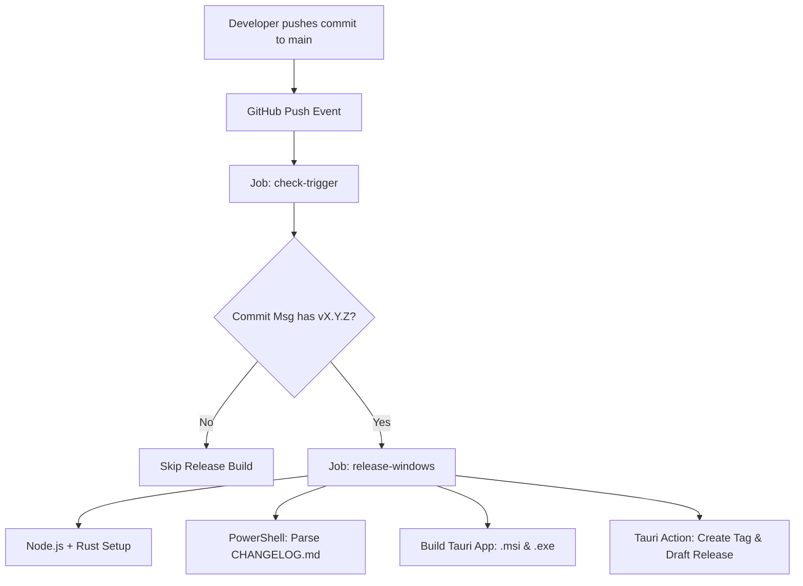

# 🚀 Automated Release Workflow (CI/CD)

PurgeKit features a fully automated Continuous Integration & Continuous Delivery (CI/CD) pipeline on GitHub Actions. It compiles, tests, packages, and drafts releases for Windows without requiring manual build commands from developer machines.

---

## 🚀 Release Automation Architecture



---

## 📋 The Pipeline Specification

The CI/CD pipeline is defined in [release-windows.yml](file:///d:/Code/PurgeKit/.github/workflows/release-windows.yml) and runs on two consecutive jobs:

### 1. Trigger Verification (`check-trigger`)
*   **Operating System**: `ubuntu-latest`
*   **Trigger Heuristics**:
    *   **Manual Trigger**: If manually run via `workflow_dispatch`, it parses `src-tauri/tauri.conf.json` using `jq` to fetch the current version.
    *   **Commit Message Check**: Checks if the commit message matches the version regex: `v([0-9]+\.[0-9]+\.[0-9]+)`.
*   **Output**: Passes `is_release: true` and the extracted version string to the build job.

---

### 2. Windows Release Job (`release-windows`)
*   **Operating System**: `windows-latest`
*   **Rust & Node Setup**: Installs stable Rust (`dtolnay/rust-toolchain`) and Node.js 20 (`actions/setup-node`) with `npm ci`.
*   **Build Cache**: Uses `swatinem/rust-cache@v2` targeting the `src-tauri` cargo workspace to speed up compilations.

---

## 📖 Automated Changelog Parsing

Before building, the workflow runs a PowerShell step that extracts release notes from [CHANGELOG.md](file:///d:/Code/PurgeKit/CHANGELOG.md):
1.  Loads the raw content of `CHANGELOG.md`.
2.  Applies a multiline regex pattern to extract all lines under the matching version header `## [version]` up to the next version header:
    ```powershell
    $pattern = "(?s)## \[" + [regex]::Escape($version) + "\].*?\r?\n(.*?)(?=\r?\n## \[|\Z)"
    ```
3.  Sends the trimmed block as `body` to the GITHUB_OUTPUT environment.
4.  This text is automatically used by the Tauri builder as the **Release Notes Body** on GitHub, ensuring documentation stays synced.

---

## 📦 Tauri Build & Compilation

The pipeline uses `tauri-apps/tauri-action` to:
*   Run `npm run build` to compile the Svelte 5 production bundle.
*   Run `cargo build --release` in the Tauri environment to build the Rust executable.
*   Package the app into:
    *   **`.msi`**: Windows Installer package.
    *   **`.exe`**: Standalone executable.
*   Automatically create the Git version tag (e.g. `v1.0.0`) on the target commit.
*   Create a draft release on GitHub with compiled binaries attached.

---

## 🚀 How to Trigger a Release

To trigger a release:
1. Update versions in files (`package.json`, `src-tauri/Cargo.toml`, `src-tauri/tauri.conf.json`).
2. Document new items in [CHANGELOG.md](file:///d:/Code/PurgeKit/CHANGELOG.md) under a header matching your version (e.g., `## [1.0.0]`).
3. Commit and push your changes to `main` with a release tag in your commit message:
   ```bash
   git commit -m "Release v1.0.0"
   git push origin main
   ```
4. The pipeline will automatically build, create the git tag, and create the draft release for you!
