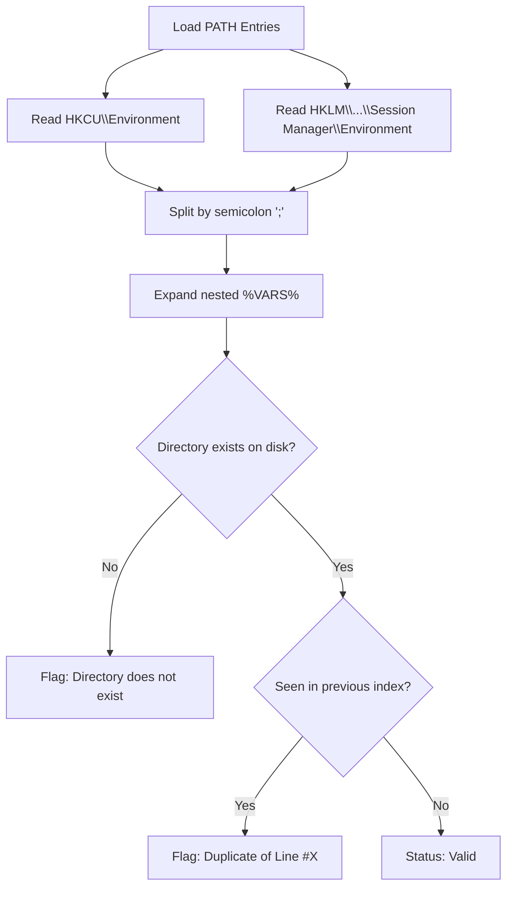

# 🖥️ PATH Environment Cleaner Guide

<p align="center">
  
  
  
</p>

<p align="center">
  <a href="../README.md">⬅️ Back to README</a>
</p>

---

## 🔎 Overview

Over time, developing and installing software on Windows pollutes the `PATH` environment variable. When applications, SDKs, or tools are moved or deleted, obsolete directory paths remain in the Windows Registry. This leads to:
1. **Broken command resolution**: Terminal lookups traversing dead paths before finding valid binaries.
2. **Path truncation limits**: Classical Win32 APIs and command shells failing when total PATH length exceeds limits (1024 or 2048 characters).
3. **Toolchain collisions**: Duplicate and conflicting runtime versions (Node, Python, Go, Rust) competing in the environment order.

The **PATH Environment Cleaner** audits, repairs, and sanitizes both **User** and **System** environments with surgical precision.

---

## 🗃️ Storage Hives & Registry Keys

PurgeKit accesses and manages environment paths across two distinct registry scopes:

| Scope | Registry Hive | Path Key | Permissions Required |
|---|---|---|---|
| **User PATH** | `HKEY_CURRENT_USER` | `Environment` | Standard User |
| **System PATH** | `HKEY_LOCAL_MACHINE` | `SYSTEM\CurrentControlSet\Control\Session Manager\Environment` | **Administrator** |



---

## 🔬 Validation & Diagnosis Engine

When `get_path_entries` runs, each path item undergoes deep validation:

### 1. Nested Variable Expansion
Windows paths often use variables like `%USERPROFILE%\AppData\Local\Programs\...` or `%SystemRoot%\System32`. PurgeKit resolves nested variables natively via Win32 `ExpandEnvironmentStringsW` before checking directory existence on disk.

### 2. Dead Path Detection
If `Path::is_dir()` returns `false` on the fully-expanded absolute path, the entry is flagged as:
`Directory does not exist`

### 3. Case-Insensitive Deduplication
Windows paths are case-insensitive. PurgeKit maintains an index lookup map `HashMap<String, usize>` using normalized lowercase paths (trimmed of trailing slashes). If a path repeats, it is flagged with its exact first occurrence:
`Duplicate of line #<first_index + 1>`

---

## 🛡️ Safe Deletion & Registry Preservation

When users clean dead or redundant paths:
1. **Index-Based Tracking**: Selections are tracked by table row index `idx` rather than string values. This ensures selecting a duplicate does not delete the original valid entry.
2. **`REG_EXPAND_SZ` Preservation**: Preserves unexpanded variables (like `%USERPROFILE%`) by writing them back as `REG_EXPAND_SZ` with null-terminated UTF-16 byte sequences.
3. **Live System Broadcast (`WM_SETTINGCHANGE`)**: Once written, PurgeKit broadcasts a Windows message to notify all running top-level windows:
   ```rust
   SendMessageTimeoutW(
       HWND_BROADCAST,
       WM_SETTINGCHANGE,
       0,
       wide_env.as_ptr() as isize,
       SMTO_ABORTIFHUNG,
       5000,
       &mut result,
   );
   ```
   *Newly launched command prompts and terminals immediately recognize the updated environment without requiring a system reboot.*

---

## 🔒 UAC Elevation & Fail-Safe Boundaries

* Modifying **User PATH** is accessible without elevation.
* Modifying **System PATH** strictly enforces `is_elevated::is_elevated()` validation on the Rust backend. Non-elevated attempts immediately return `Access Denied` and prompt the user to launch PurgeKit as Administrator.
* **Fail-Safe Zeroing Protection**: PurgeKit strictly forbids completely wiping the System PATH. If all system paths are selected for deletion or an empty list is submitted, the operation is blocked both at the UI layer and in the backend `set_path_entries` gate to prevent Windows service instability.
