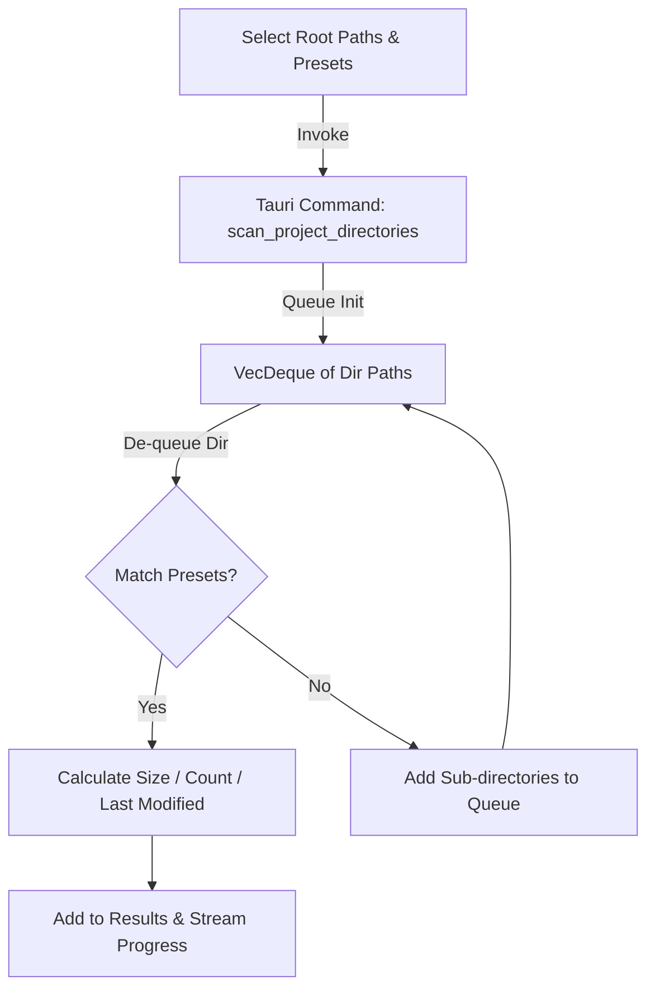

# 🗂️ Universal Project Sweeper Detailed Guide

The **Universal Project Sweeper** scans development directories to find and purge bulky compiler outputs, package manager caches, and local dependencies (e.g., `node_modules`, `target`, `.venv`) that occupy unnecessary space.

---

## 🔍 How the Sweeper Works

Instead of running slow search engines or command prompt utilities, PurgeKit implements a fast, multi-threaded workspace scanner in Rust using `walkdir` and `VecDeque`.



---

## 🎛️ Scanning Parameters & Limits

To balance speed and prevent system hangs, the Project Sweeper operates with strict boundaries:

*   **🔒 Maximum Scan Depth**: The scan will not descend more than **8 directories deep** (`depth > 8`) from any root path. This prevents infinite symlink loops or scouring deeply nested system folders.
*   **🚫 Excluded Folders**: The scanner automatically skips and ignores these directories (case-insensitive):
    *   VCS metadata: `.git`, `.svn`, `.hg`
    *   System & User data: `AppData`, `Local Settings`, `System Volume Information`, `$RECYCLE.BIN`
    *   Protected locations: `Windows`, `Program Files`, `Program Files (x86)`

---

## 📋 Default Folder Presets

You can search for any combination of the following common developer folder names:

| Preset Name | Target Directory Name | Language/Framework | Description |
|---|---|---|---|
| **NodeJS** | `node_modules` | JavaScript / TypeScript | External package directories |
| **Rust** | `target` | Rust | Cargo compiler outputs & debug/release builds |
| **Python** | `venv`, `.venv` | Python | Virtual environments containing pip packages |
| **C# / .NET** | `bin`, `obj`, `.vs` | C# / VB.NET / F# | Build files, compiled dlls, VS user cache |
| **Java** | `build`, `.gradle` | Java / Gradle | Gradle compiler caches and built archives |
| **SvelteKit** | `.svelte-kit` | SvelteKit | Local build caches and route definitions |
| **Next.js** | `.next` | React / Next.js | Serverless bundles and frontend builds |

---

## 📊 File Size & Metadata Calculation

Once a target folder matches a preset (for example, finding `D:\Code\my-app\node_modules`):
1.  **Direct File Iteration**: PurgeKit recursively crawls all files within the matched directory using `walkdir`. It sums the exact byte length (`metadata.len()`) of every file and counts the total files.
2.  **Date Retrieval**: It reads the directory's metadata and extracts the **Last Modified Time** (`modified()`) formatted to `YYYY-MM-DD HH:MM:SS`. This makes it easy to identify obsolete directories.
3.  **Parent Extraction**: The parent folder of the matched directory is parsed to extract the project name (e.g. `my-app`).

---

## 📡 Live Progress Streaming

Scanning large drives can take time. To ensure a smooth UI experience, PurgeKit streams real-time feedback to the Svelte 5 frontend using Tauri IPC events:

*   **Event Name**: `project-scan-progress`
*   **Throttling**: The event is emitted once every **50 directories** traversed.
*   **Payload Schema**:
    ```json
    {
      "current_dir": "D:\\Workspace\\project-name\\node_modules",
      "folders_found": 12,
      "total_size_bytes": 451829023
    }
    ```
*   The frontend uses this payload to display a progress indicator showing the active search path and the running size accumulator.

---

## 🧼 Permanent Purging Logic

When you select directories in the Svelte table and click **Purge**, PurgeKit performs a permanent delete:
*   Directories are deleted using Rust's `fs::remove_dir_all`.
*   This is a **destructive process** (files bypass the Recycle Bin).
*   Deleted sizes are subtracted from the system disk storage stats dynamically in the UI.
