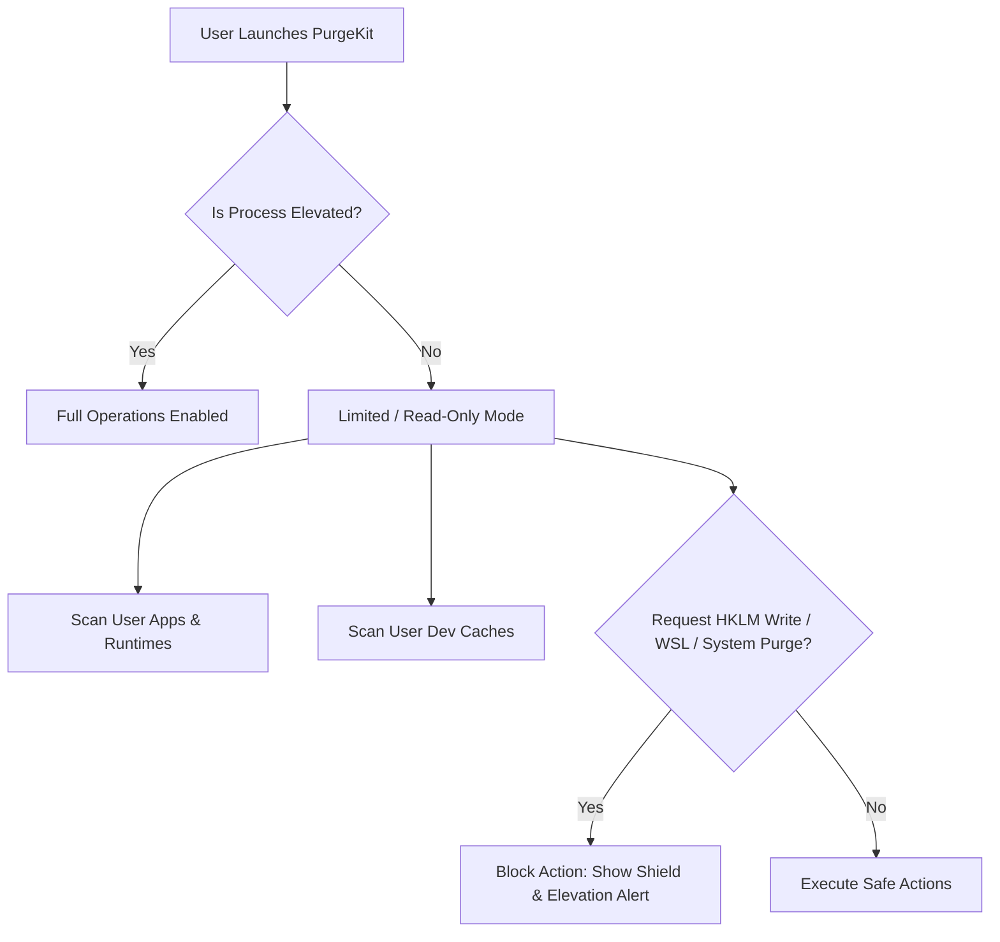

# 🔐 Security & UAC Elevation Model

PurgeKit operates on Windows as a hybrid-privilege application. It uses a dynamic security checks system rather than forcing global Administrator elevation at startup. This enables safe, read-only system audits for non-elevated users, while prompting for Windows User Account Control (UAC) elevation only when high-privilege operations are requested.

---

## 🏗️ Privilege Architecture



---

## 🛡️ Trust Manifest & Default Execution Level

PurgeKit packages a Win32 application manifest (`app.manifest`) configured to launch as a standard user process by default:

```xml
<requestedExecutionLevel
  level="asInvoker"
  uiAccess="false"
/>
```

### Why `asInvoker` instead of `requireAdministrator`?
1.  **Fast Startup**: The app opens instantly without blocking the user with a dim-screen UAC prompt.
2.  **Safety Audits**: Developers can safely audit their workspace caches, inspect PATH variables, and list applications without granting the app full administrative write-access to the OS.
3.  **Low Profile**: Decreases the attack surface of the application.

---

## 🕵️ Dynamic Elevation Detection in Rust

To enforce safety boundaries, PurgeKit checks process elevation on-demand using the `is_elevated` crate. Under the hood, this makes Windows Security Token API calls:

*   **API Check**: Calls `GetTokenInformation` querying the process token's `TokenElevation` property.
*   **Tauri Command**: Exposed via the IPC command `check_is_admin` to coordinate UI elements in Svelte 5:
    ```rust
    #[tauri::command]
    pub async fn check_is_admin() -> Result<bool, String> {
        Ok(is_elevated::is_elevated())
    }
    ```

---

## 🧱 Privilege Boundaries & Warning Shields

If the process is *not* elevated, PurgeKit enforces execution limits across its modules:

| Module | Non-Elevated Action (Permitted) | Protected Action (Requires Elevation) |
|---|---|---|
| **Apps Manager** | Scan user-level applications, uninstall HKCU desktop apps. | Uninstall system-wide apps (HKLM), uninstall Windows Store (UWP) apps. |
| **WSL Disk Shrinker** | View registered WSL distributions. | Stop WSL subsystem (`wsl --shutdown`), run `DiskPart` mount/compaction. |
| **PATH Cleaner** | View all paths, remove/modify User PATH entries (`HKCU\Environment`). | Remove/modify System PATH entries (`HKLM\...\Session Manager\Environment`). |
| **Startup Manager** | View startup entries, toggle HKCU startup items. | Toggle or delete HKLM startup items, toggle Common Startup directory files, manage Scheduled Tasks. |
| **Registry Snapshots**| Audits registry keys under HKCU. | Deep audits under HKLM/Wow6432Node registry paths. |

---

## 🛡️ Local Privilege Escalation (LPE) & Tampering Safeguards

To prevent standard users from manipulating PurgeKit (when running elevated as Administrator) to execute arbitrary commands or delete protected OS files, the following strict validations are implemented on the backend:

### 1. PATH Hijacking Protections
- All child process executions (e.g., `cmd.exe`, `powershell.exe`, `rustup`, `npm`, `fnm`, `diskpart.exe`, `reg.exe`) explicitly override the process environment `PATH` variable using `winutil::get_secure_system_path()`.
- This ensures only system-directory executables (`C:\Windows\System32`, `C:\Windows\System32\wbem`, etc.) are spawned, neutralizing DLL/executable hijacking via custom user PATH variables.

### 2. Dev Tools Config Command Whitelisting
- Cache cleaning configurations can be modified dynamically via `%LOCALAPPDATA%\PurgeKit\devtools_rules.json`.
- To prevent users from inputting malicious commands in this JSON rules file, PurgeKit checks the `clean_command` against a hardcoded whitelist (`SAFE_DEV_TOOL_CLEAN_COMMANDS`).
- If the command is not whitelisted, PurgeKit blocks shell execution completely and falls back to direct directory purging using native Rust file APIs.

### 3. Safe Filesystem & Registry Deletion Gates
- All directory/file deletions pass through `winutil::is_safe_to_delete`. Deletions of root drives (e.g. `C:\`), Windows directories (`C:\Windows`, `C:\Windows\System32`), or other user profiles are strictly blocked.
- Registry deletions are validated via `winutil::is_safe_registry_key`, preventing any manipulation of core system boot keys or other protected paths.

### 4. Path Confinement Policies
- Toggles and deletions for Startup items and Scheduled Tasks are confined using `is_in_startup_dir` and `is_in_tasks_dir`. Any operations targeting paths outside these folders are denied.
- Toolchain sweeps are confined using `is_in_toolchain_dir` to ensure deletions are limited to legitimate NVM, FNM, and Rustup compiler directories.

### 5. Silent Uninstallation Command Safety
- All dynamic silent uninstall commands are parsed and validated via `validate_uninstall_command_safety`.
- Any command utilizing a shell wrapper that references user-writable locations (e.g., `Users\<Name>\AppData\Temp`) is blocked.
- Any uninstaller executable in a user-writable directory (e.g., `Downloads`) must be signed with a valid digital signature if running elevated; unsigned executables are blocked to mitigate LPE.

---

## 🔴 Handling Permission Denied Errors

If you attempt a protected operation while running in user mode:
1.  **Alert Banners**: Svelte displays a golden shield icon next to HKLM directories or system settings.
2.  **Rust Safeguards**: Backend commands verify `check_is_admin()` inside their execution block. If it returns `false`, they abort the operation immediately and return a descriptive error:
    `"Modifying system startup items requires Administrator privileges. Please restart the application as Administrator."`
3.  **Elevation Prompt**: To unlock all features, close PurgeKit, right-click the executable, and select **Run as Administrator**.
