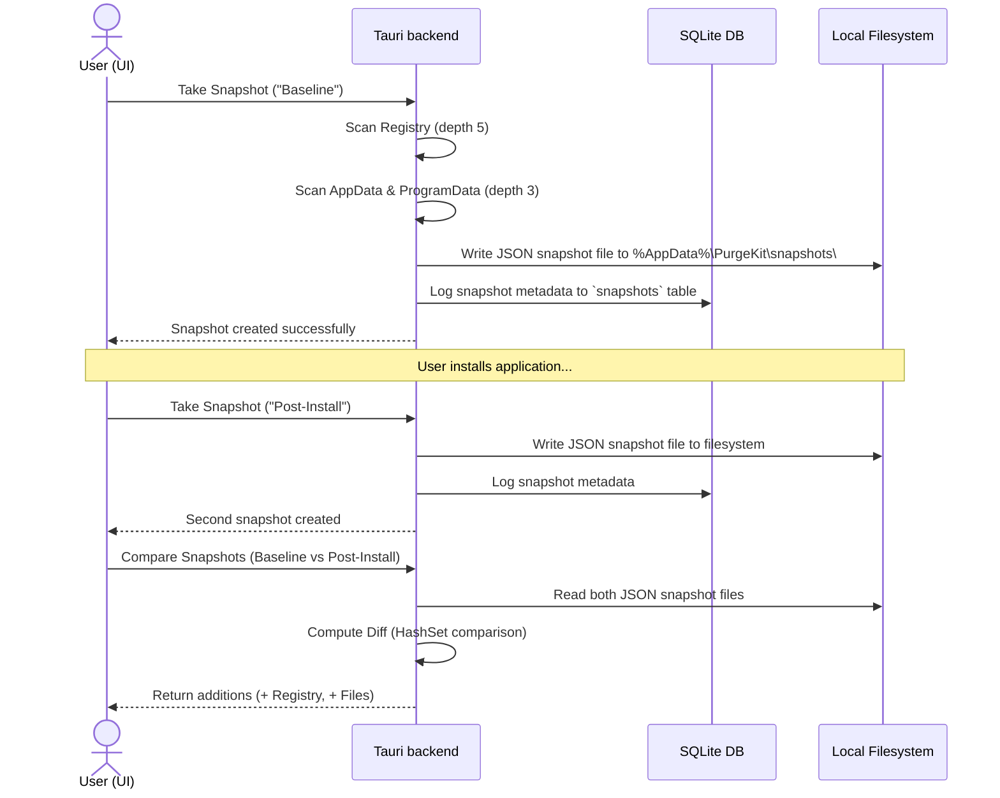

# 📸 System Snapshot Engine

The **System Snapshot Engine** tracks installations and system modifications by comparing "before" (baseline) and "after" (post-install) snapshots of registry entries and file trees.

---

## 🏗️ Snapshot Workflow



---

## 🔎 Crawler Configuration & Scanning Limits

To scan the system efficiently without causing out-of-memory errors or locking up the OS, PurgeKit restricts snapshot scanning:

### 1. 🗃️ Registry Scanning
PurgeKit crawls keys recursively up to a **maximum depth of 5 subkeys** starting from:
*   `HKCU\SOFTWARE` (`HKEY_CURRENT_USER\SOFTWARE`)
*   `HKLM\SOFTWARE` (`HKEY_LOCAL_MACHINE\SOFTWARE`)

Inaccessible registry paths (due to security permissions) are automatically caught and ignored in the background.

---

### 2. 📁 Filesystem Scanning
PurgeKit indexes directories up to a **maximum depth of 3 folders** starting from:
*   `%AppData%` (`C:\Users\<Username>\AppData\Roaming`)
*   `%LocalAppData%` (`C:\Users\<Username>\AppData\Local`)
*   `%ProgramData%` (`C:\ProgramData`)

It uses `walkdir` to index folder structures, files, sizes, and file paths.

---

## 💾 Snapshot Storage & Serialization

Each snapshot consists of:
1.  **Metadata Record**: Logged to the local SQLite database (`purgekit.db`) in the `snapshots` table.
    ```sql
    CREATE TABLE IF NOT EXISTS snapshots (
        id TEXT PRIMARY KEY,           -- UUID v4
        name TEXT NOT NULL,            -- Custom user-assigned name
        created_at TEXT NOT NULL,      -- Timestamp (YYYY-MM-DD HH:MM:SS)
        data_file_path TEXT NOT NULL   -- Path to JSON file
    );
    ```
2.  **Snapshot File**: A JSON document stored in `%AppData%\PurgeKit\snapshots\snap_[UUID].json`.
    ```json
    {
      "registry_keys": [
        "HKCU\\SOFTWARE\\Microsoft\\Windows\\CurrentVersion\\...",
        "HKLM\\SOFTWARE\\Node.js"
      ],
      "files": [
        "C:\\Users\\Admin\\AppData\\Local\\Temp\\...",
        "C:\\ProgramData\\Microsoft\\..."
      ]
    }
    ```

---

## ⚖️ Git-style Delta Difference Engine

When you select two snapshots and click **Compare**, PurgeKit runs the comparison logic:
*   The snapshots' data files are read and deserialized in Rust.
*   The baseline registry paths and filesystem paths are loaded into two independent `HashSet` structures for $O(1)$ lookup time:
    *   `before_registry: HashSet<&String>`
    *   `before_files: HashSet<&String>`
*   PurgeKit iterates through the post-installation snapshot's lists. Any item not found in the baseline set is classified as an addition:
    *   `new_registry_keys`: Registry entries created by the installer.
    *   `new_files`: Binaries, files, or folders created by the installer.
*   These differences are compiled and returned to the Svelte 5 frontend as a `SnapshotDiff` payload, allowing developers to review and trigger deep cleans.
