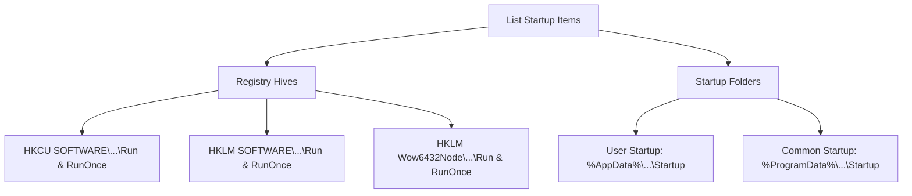

# 🚀 Startup Manager & Autoruns Guide

The **Startup Manager** in PurgeKit allows you to audit, disable, enable, and delete programs configured to run automatically when Windows boots. Disabling startup bloat significantly improves system boot times and saves background memory.

---

## 🔎 Scanning Hives & Paths

PurgeKit scans two primary mechanisms Windows uses to trigger startup programs: the **System Registry** and **Startup Directories**.



---

## 🔒 Security Hives Detail

### 1. Registry Run & RunOnce Keys
PurgeKit queries the following registry subkeys (both for 32-bit and 64-bit application environments):
*   `HKEY_CURRENT_USER\SOFTWARE\Microsoft\Windows\CurrentVersion\Run`
*   `HKEY_CURRENT_USER\SOFTWARE\Microsoft\Windows\CurrentVersion\RunOnce`
*   `HKEY_LOCAL_MACHINE\SOFTWARE\Microsoft\Windows\CurrentVersion\Run`
*   `HKEY_LOCAL_MACHINE\SOFTWARE\Microsoft\Windows\CurrentVersion\RunOnce`
*   `HKEY_LOCAL_MACHINE\SOFTWARE\Wow6432Node\Microsoft\Windows\CurrentVersion\Run`
*   `HKEY_LOCAL_MACHINE\SOFTWARE\Wow6432Node\Microsoft\Windows\CurrentVersion\RunOnce`

---

### 2. Filesystem Startup Folders
PurgeKit searches the physical folders where Windows looks for shortcuts (`.lnk`) or executables (`.exe`) to run on login:
*   **User Profile**: `%AppData%\Microsoft\Windows\Start Menu\Programs\Startup`
*   **All Users**: `%ProgramData%\Microsoft\Windows\Start Menu\Programs\Startup`

---

## ⚙️ Enabling & Disabling Logic

To avoid corrupting the system or permanently deleting files when a user simply wants to *disable* a startup program temporarily, PurgeKit implements a safe, reversible toggle system:

### 🔄 Registry Toggles
*   **Disabling**: PurgeKit creates a custom subkey named `PurgeKit_Disabled` within the target Run/RunOnce key. It moves the target value (e.g. name and command string) into this subkey, removing it from active Windows execution.
*   **Enabling**: It reads the raw value from the `PurgeKit_Disabled` subkey, writes it back into the parent Run key, and deletes it from `PurgeKit_Disabled`.

```
Active Run Key
└── [Value] Discord.exe = "C:\Users\Admin\AppData\Local\Discord\app.exe"
    
Disabled (Discord is toggled OFF in PurgeKit)
└── PurgeKit_Disabled
    └── [Value] Discord.exe = "C:\Users\Admin\AppData\Local\Discord\app.exe"
```

---

### 📁 Filesystem Toggles
*   **Disabling**: PurgeKit renames the shortcut file, appending `.disabled` to its extension. For example, `Spotify.lnk` becomes `Spotify.lnk.disabled`. Windows ignores files with `.disabled` extensions during boot.
*   **Enabling**: It renames the file back to its original name, stripping the `.disabled` suffix.

---

## 🛡️ Deletion & Privilege Guardrails

*   **Permanently Deleting**: If you click the trash icon, PurgeKit deletes the registry value from both the active Run key and the `PurgeKit_Disabled` subkey, or permanently deletes the shortcut file using `fs::remove_file`.
*   **UAC Admin Enforcement**:
    *   Startup items stored in `HKEY_CURRENT_USER` or the User Startup Folder can be modified by non-elevated users.
    *   Startup items stored in `HKEY_LOCAL_MACHINE` or the Common/All Users Startup Folder (`%ProgramData%`) affect all users and **require Administrator privileges**.
    *   If you attempt to modify HKLM keys or Common Startup files without launching PurgeKit as Administrator, the operation will cancel and prompt you to run as Administrator.
