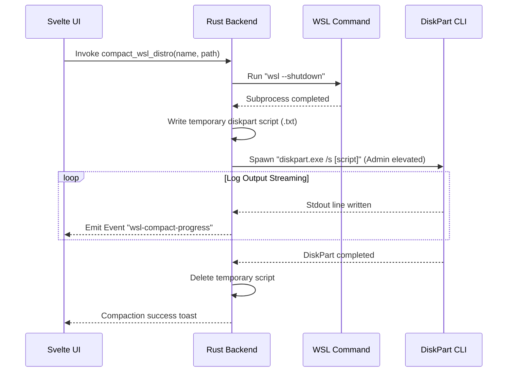

# 🐋 WSL2 Virtual Disk Compaction Deep Dive

<p align="center">
  
  
</p>

This document details the virtual disk structure, Windows registry bindings, Win32 API checks, and scripting details behind the **WSL2 Virtual Disk Shrinker** module.

---

## 🔍 1. WSL2 Disk Virtualization & Bloating

WSL2 runs Linux distributions inside a lightweight utility virtual machine. The virtual disk image of a distribution is stored as an **ext4.vhdx** file (Virtual Hard Disk v2).

* **Dynamic Expansion**: The `.vhdx` file expands dynamically as files are created inside Linux.
* **Lack of Auto-Shrink**: When you delete files in Linux, the Linux file system marks those blocks as free, but the Windows host file system (NTFS) does not reclaim the sectors. The `.vhdx` file size remains at its peak size, resulting in significant storage wastage.

---

## 🗂️ 2. Distribution Discovery (Registry Scans)

PurgeKit discovers installed WSL2 distributions by querying the User registry:

```
Registry Path: HKCU\Software\Microsoft\Windows\CurrentVersion\Lxss
```

1. **Subkeys traversal**: Every subkey is a UUID representing a registered WSL distribution.
2. **Values extracted**:
   * `DistributionName`: e.g. `Ubuntu`, `kali-linux`, `docker-desktop-data`.
   * `BasePath`: e.g. `C:\Users\<User>\AppData\Local\Packages\CanonicalGroupLimited...`.
3. **VHDX Resolution**: PurgeKit combines `BasePath` with `ext4.vhdx` to get the absolute path. It calculates the disk size by querying the host file size of this `.vhdx`.

---

## 🔌 3. Native Sparse File Check (Win32 API)

Windows 11 supports setting the VHDX file as **Sparse**. PurgeKit checks this property natively using Rust's FFI bindings to Windows APIs:

```rust
use std::os::windows::fs::MetadataExt;
let meta = std::fs::metadata(vhdx_path)?;
let attributes = meta.file_attributes();
let is_sparse = (attributes & 0x200) != 0; // FILE_ATTRIBUTE_SPARSE_FILE
```

* **Sparse Disk (Dynamic compacting)**: If marked as sparse, NTFS allows the file to release unused sectors back to the host dynamically.
* **Thick Disk (Traditional)**: Occupies the entire allocated size on the host SSD.

---

## ⚙️ 4. Compaction Sequence Execution

When compacting a disk, PurgeKit executes the following sequence:



### 📄 Temporary DiskPart Script Content:
```cmd
select vdisk file="D:\WSL\Ubuntu\ext4.vhdx"
attach vdisk readonly
compact vdisk
detach vdisk
```

By mounting the virtual disk in `readonly` mode, Windows can safely run the `compact` command to consolidate free space and shrink the `.vhdx` file size down to its actual Linux contents.
